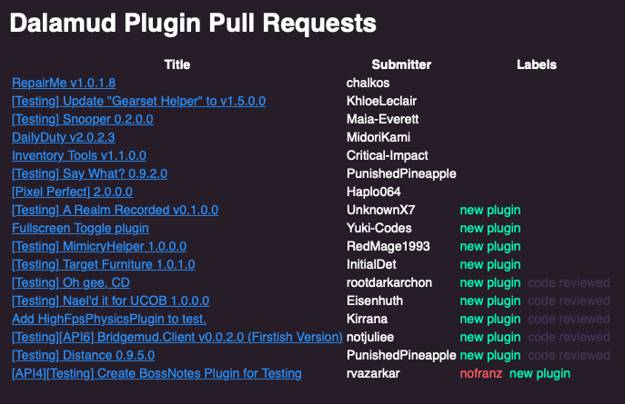

# Caprine Operator
*The* goatcorp email reporting service.

## Environment variables
* `OPERATOR_EMAIL`: The email address to use for sending emails.
* `OPERATOR_PASSWORD`: The password corresponding to the email address.
* `OPERATOR_SMTP_SERVER`: The SMTP server to be used for sending emails.
* `OPERATOR_IMAP_SERVER`: The IMAP server to be used for receiving emails.
* `OPERATOR_POSTGRES`: The PostgreSQL host server override (optional). Defaults to `localhost`. If the application is being run inside of a Docker container, this needs to be overriden.
* `OPERATOR_INBOX`: The inbox that should be used for emails sent to Caprine Operator.

## Notes for admins
The Operator checks *unread* emails periodically for user interactions. Please refrain from checking the Operator's unread emails manually (read emails are fine).
